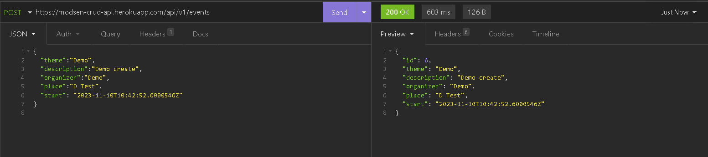

<h1 align="center">MODSEN</h1>
<h2 align="center">🚀 Test task - Meetup API</h2>

[](https://www.repostatus.org/#wip)
[](https://github.com/IvanHayel/modsen-crud-api/blob/master/LICENSE.md)
[](http://hits.dwyl.com/IvanHayel/modsen-crud-api)
[](https://github.com/IvanHayel)

<details>
  <summary style="font-weight: bold; font-size: large">Table of Contents</summary>
  <ol>
    <li>
      <a href="#-task-description">Task Description</a>
      <ul>
        <li><a href="#-task">Task</a></li>
        <li><a href="#-main-technologies">Main Technologies</a></li>
        <li><a href="#-special-requirements">Special Requirements</a></li>
        <li><a href="#-additional-technologies">Additional Technologies</a></li>
      </ul>
    </li>
    <li>
      <a href="#%EF%B8%8F-getting-started">Getting Started</a>
      <ul>
        <li><a href="#-the-easiest-way-">The Easiest Way</a></li>
        <li><a href="#-start-with-docker">Start with Docker</a></li>
        <li><a href="#-local-startup-with-gradle">Local Startup with Gradle</a></li>
      </ul>
    </li>
    <li>
        <a href="#-api-usage">API Usage</a>
    </li>
    <li>
        <a href="#-demo">Demo</a>
        <ul>
            <li><a href="#get-all-events">Get all events</a></li>
            <li><a href="#get-all-events-with-restrictions">Get all events with restrictions</a></li>
            <li><a href="#get-event-by-id">Get event by id</a></li>
            <li><a href="#full-text-search">Full text search</a></li>
            <li><a href="#create-new-event">Create new event</a></li>
            <li><a href="#update-existing-event">Update existing event</a></li>
            <li><a href="#delete-event">Delete event</a></li>
        </ul>
    </li>
  </ol>
</details>

## 📄 Task Description

### 📝 Task

>Development of CRUD REST API for working with `Events`.
> 
>The application must be accompanied by a README.md file with instructions for project startup.

### 📝 Main Technologies


| **Database** |                                                                                                                                   [](https://www.postgresql.org/)                                                                                                                                   |
|:------------:|:-------------------------------------------------------------------------------------------------------------------------------------------------------------------------------------------------------------------------------------------------------------------------------------------------------------------------------------------------------------------------------------------------------------------------:|
| **Backend**  |                                                                              [](https://dev.java/) [](https://spring.io/)                                                                               |

### 📝 Special Requirements
> Using pure Hibernate (Spring Data JPA wrapper not allowed)

### 📝 Additional Technologies
> 1. Integration or unit tests.
> 
> 2. Database migration (Liquibase or Flyway).
> 
> 3. Ability to run from docker-compose.
> 
> 4. Ability to filter and sort `Events`.
> 
> 5. Using environment variables.

---

## ⚙️ Getting Started

### ⏩ The Easiest Way ⏩

<strong>API already deployed on PAAS Heroku:</strong>

### [🚀 Heroku link](https://modsen-crud-api.herokuapp.com/api/v1/events)

#### <strong><a href="#-api-usage">JUMP TO API USAGE</a></strong>

### 🐋 Start with Docker

* Clone the repository

```console
git clone https://github.com/IvanHayel/modsen-crud-api.git
```

* Use docker-compose

```console
docker-compose up
```

#### <strong><a href="#-api-usage">JUMP TO API USAGE</a></strong>

### 🦖 Local Startup with Gradle

> Java version 17+ is required.

* Clone the repository

```console
git clone https://github.com/IvanHayel/modsen-crud-api.git
```

* Create Postgres Database

Example:
```postgresql
CREATE DATABASE "modsen-api"
    WITH 
    OWNER = postgres
    ENCODING = 'UTF8'
    LC_COLLATE = 'English_World.1252'
    LC_CTYPE = 'English_World.1252'
    TABLESPACE = pg_default
    CONNECTION LIMIT = -1;
```

* Set up environment variables

> DB_URL - JDBC url for Postgres database.
> 
> DB_USERNAME - database username
> 
> DB_PASSWORD - database password

* Run Gradle

```console
gradle clean build bootRun
```

> You can also use the gradle wrapper: `./gradlew`

---

## 🔥 API Usage

> ### ⚠️ Attention! Date and time in API is valid only in ISO 8601 format! ⚠️ 

### 💠 Endpoints
| **HTTP METHOD** |         **URL**         | **QUERY PARAMETERS**                                                                                                                                                                                                                                                                                                                          |                        **TEMPLATE**                        | *DESCRIPTION*                                             |
|:---------------:|:-----------------------:|:----------------------------------------------------------------------------------------------------------------------------------------------------------------------------------------------------------------------------------------------------------------------------------------------------------------------------------------------|:----------------------------------------------------------:|-----------------------------------------------------------|
|     **GET**     |    `/api/v1/events`     | `sortedBy`: id (default), theme, organizer, start, place - <i>not required</i> <br/> `direction`: asc (default), desc - <i>not required</i> <br/> `theme`: {any} - <i>not required</i> <br/> `organizer`: {any} - <i>not required</i> <br/> `start`: {Date/time in ISO 8601} - <i>not required</i> <br/> `place`: {any} - <i>not required</i> |                            none                            | Getting all `Events` with the ability to filter and sort. |
|     **GET**     |  `/api/v1/events/{id}`  | <center>none</center>                                                                                                                                                                                                                                                                                                                         |                            none                            | Getting an `Event` by id.                                 |
|     **GET**     | `/api/v1/events/search` | `term`: {any} - <i>required</i>                                                                                                                                                                                                                                                                                                               |                            none                            | Full text search for all `Events`.                        |
|    **POST**     |    `/api/v1/events`     | <center>none</center>                                                                                                                                                                                                                                                                                                                         |  | Creating a new `Event`.                                   |
|     **PUT**     |    `/api/v1/events`     | <center>none</center>                                                                                                                                                                                                                                                                                                                         |   | Updating existing `Event`.                                |
|   **DELETE**    |  `/api/v1/events/{id}`  | <center>none</center>                                                                                                                                                                                                                                                                                                                         |                            none                            | Deleting `Event` by id.                                   |

---

## 🪄 Demo

> Insomnia used for demonstration.

### Get all events


### Get all events with restrictions


### Get event by id


### Full text search


### Create new event



### Update existing event


### Delete event

